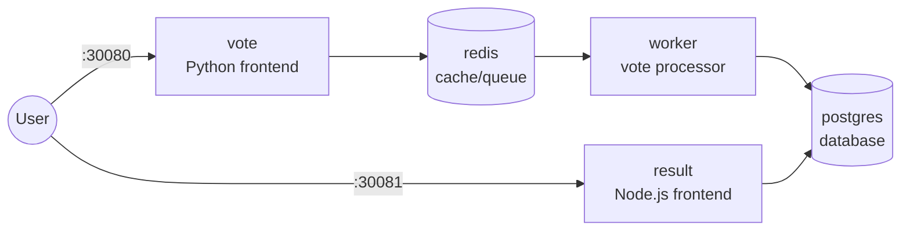

# Voting App on Bare-Metal Kubernetes

A microservices voting application deployed on a self-provisioned, 3-node
Kubernetes cluster — built from scratch on local VMs (Multipass), without
a managed control plane or cloud provider. This project demonstrates
end-to-end infrastructure setup: VM provisioning, container runtime
configuration, cluster bootstrapping, networking, and application
deployment.

> **Why bare-metal instead of a managed service?** Tools like EKS or
> minikube abstract away most of the operational work. Building this by
> hand — configuring `containerd`, resolving cgroup driver mismatches,
> wiring up CNI networking — was a deliberate choice to understand what
> those managed services normally do for you.

---

## Architecture



| Service  | Role                                      | Exposed via        |
|----------|-------------------------------------------|---------------------|
| `vote`   | Python frontend — users cast a vote       | NodePort `:30080`   |
| `redis`  | In-memory queue between vote and worker   | ClusterIP (internal)|
| `worker` | Moves votes from redis into postgres      | Not exposed         |
| `db`     | PostgreSQL — stores the final tally       | ClusterIP (internal)|
| `result` | Node.js frontend — live results           | NodePort `:30081`   |

---

## Infrastructure

| Component         | Detail                                   |
|--------------------|-------------------------------------------|
| Virtualization      | [Multipass](https://multipass.run/)      |
| VM OS                | Ubuntu 26.04                            |
| Cluster nodes         | 3 (1 control plane, 2 workers)         |
| VM specs               | 2 vCPU / 2 GB RAM / 10 GB disk each  |
| Cluster bootstrap        | `kubeadm`                          |
| Container runtime          | `containerd`                    |
| CNI (pod networking)         | Calico v3.28                  |
| Application deployment         | Raw Kubernetes manifests    |

---

## Prerequisites

- [Multipass](https://multipass.run/install) installed on your host machine
- At least 8 GB RAM and 4 CPU cores free on the host (3 VMs × 2 GB/2 vCPU)
- Basic familiarity with the Linux command line

---

## Step-by-Step Setup

### 1. Provision the VMs

```bash
multipass launch --name control-panel --cpus 2 --memory 2G --disk 10G 26.04
multipass launch --name node-1        --cpus 2 --memory 2G --disk 10G 26.04
multipass launch --name node-2        --cpus 2 --memory 2G --disk 10G 26.04
```

Confirm they're running and note their IPs:
```bash
multipass list
```

Shell into each one for the steps below:
```bash
multipass shell control-panel
```

### 2. Prepare every node (run on all 3 VMs)

Disable swap:
```bash
sudo swapoff -a
sudo sed -i '/ swap / s/^/#/' /etc/fstab
```

Load required kernel modules:
```bash
cat <<EOF | sudo tee /etc/modules-load.d/containerd.conf
overlay
br_netfilter
EOF
sudo modprobe overlay
sudo modprobe br_netfilter
```

Set required sysctl parameters:
```bash
cat <<EOF | sudo tee /etc/sysctl.d/99-kubernetes-cri.conf
net.bridge.bridge-nf-call-iptables  = 1
net.ipv4.ip_forward                 = 1
net.bridge.bridge-nf-call-ip6tables = 1
EOF
sudo sysctl --system
```

### 3. Install and configure containerd (all 3 VMs)

```bash
sudo apt update
sudo apt install -y containerd
sudo mkdir -p /etc/containerd
containerd config default | sudo tee /etc/containerd/config.toml
```

Set the `systemd` cgroup driver — required so `containerd` and `kubelet`
share a single, consistent view of cgroup state:
```bash
sudo sed -i 's/SystemdCgroup = false/SystemdCgroup = true/' /etc/containerd/config.toml
sudo systemctl enable containerd
sudo systemctl restart containerd
```

### 4. Install kubeadm, kubelet, and kubectl (all 3 VMs)

```bash
sudo apt install -y apt-transport-https ca-certificates curl gpg
curl -fsSL https://pkgs.k8s.io/core:/stable:/v1.31/deb/Release.key | \
  sudo gpg --dearmor -o /etc/apt/keyrings/kubernetes-apt-keyring.gpg
echo 'deb [signed-by=/etc/apt/keyrings/kubernetes-apt-keyring.gpg] https://pkgs.k8s.io/core:/stable:/v1.31/deb/ /' | \
  sudo tee /etc/apt/sources.list.d/kubernetes.list
sudo apt update
sudo apt install -y kubelet kubeadm kubectl
sudo apt-mark hold kubelet kubeadm kubectl
```

> Adjust the `v1.31` version path above to match the Kubernetes release
> you're targeting.

### 5. Initialize the control plane (control-panel VM only)

```bash
sudo kubeadm init --pod-network-cidr=192.168.0.0/16
```

Set up `kubectl` access for your user:
```bash
mkdir -p $HOME/.kube
sudo cp -i /etc/kubernetes/admin.conf $HOME/.kube/config
sudo chown $(id -u):$(id -g) $HOME/.kube/config
```

**Save the `kubeadm join` command printed at the end of this output** —
you'll need it in step 7.

### 6. Install the CNI plugin (control-panel VM only)

```bash
kubectl apply -f https://raw.githubusercontent.com/projectcalico/calico/v3.28.0/manifests/calico.yaml
```

Confirm it rolls out:
```bash
kubectl get pods -n kube-system -w
```

### 7. Join the worker nodes (node-1 and node-2)

Run the command saved from step 5, on each worker, as root:
```bash
sudo kubeadm join <control-plane-ip>:6443 --token <token> \
  --discovery-token-ca-cert-hash sha256:<hash>
```

### 8. Verify the cluster

From the control plane:
```bash
kubectl get nodes
```
All 3 nodes should show `Ready`.

### 9. Deploy the voting app

```bash
git clone <this-repo-url>
cd voting-app-bare-metal-k8s
kubectl apply -f .
kubectl get pods -n voting-app -w
```

### 10. Access the application

```bash
curl http://<any-node-ip>:30080   # vote
curl http://<any-node-ip>:30081   # result
```

Or open both in a browser pointed at any node's IP.

---

## Tearing it down

```bash
kubectl delete namespace voting-app
multipass delete control-panel node-1 node-2 --purge
```

---

## Lessons Learned

Running `kubeadm` on bare metal surfaces failure modes that managed
platforms hide entirely. Two worth noting:

- **`containerd` and `kubelet` must agree on the cgroup driver.** Running
  a mixed setup (one on `cgroupfs`, the other on `systemd`) causes silent
  instability rather than a clear error — this reinforced why explicit,
  consistent configuration across every node matters more than relying
  on defaults.
- **Stray binaries from earlier manual installs can shadow the correct
  ones on `$PATH`.** A leftover `containerd` binary in `/usr/local/bin`
  caused a confusing container-runtime failure that looked unrelated to
  its actual cause. It was a good reminder to verify *which* binary is
  actually running, not just that a command "works."

---

## Skills Demonstrated

- Kubernetes cluster bootstrapping with `kubeadm` (control plane + multi-node joins)
- Container runtime (`containerd`) installation and configuration
- CNI networking with Calico
- Kubernetes object design: Deployments, Services (ClusterIP/NodePort), Secrets, PersistentVolumeClaims
- Linux systems troubleshooting (systemd units, journald logs, cgroups)
- Infrastructure documented and version-controlled as code

---

## Possible Improvements

- Add Ingress (e.g. NGINX Ingress Controller) instead of raw NodePorts
- Add a persistent storage provisioner (e.g. `local-path-provisioner`) for reliable PVC binding
- Convert manifests to a Helm chart for templated, repeatable deploys
- Add CI (GitHub Actions) to lint/validate manifests on push
- Add resource requests/limits and basic health checks (liveness/readiness probes) per Deployment

---

## Documentation

- [Deployment guide](#step-by-step-setup) — this file, above
- [Advanced operations](docs/advanced-operations.md) — node failure recovery, manual etcd backup/restore
- [Automated etcd backup](docs/etcd-backup-automation.md) — S3 + IAM + cron automation, production-style

---

## License

MIT — see [LICENSE](LICENSE).

## Author

Muhammad Alabadsa — [GitHub](#) · [LinkedIn](#)
